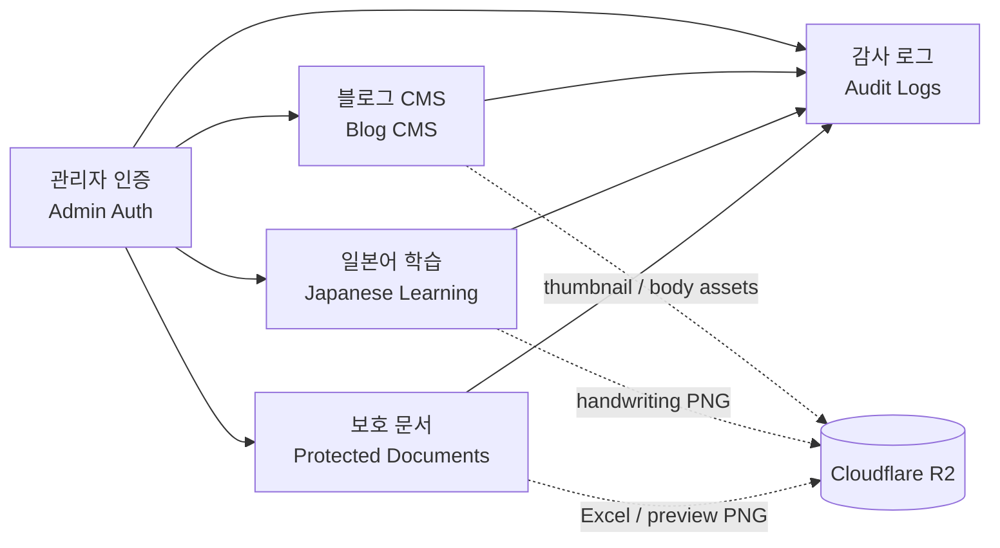
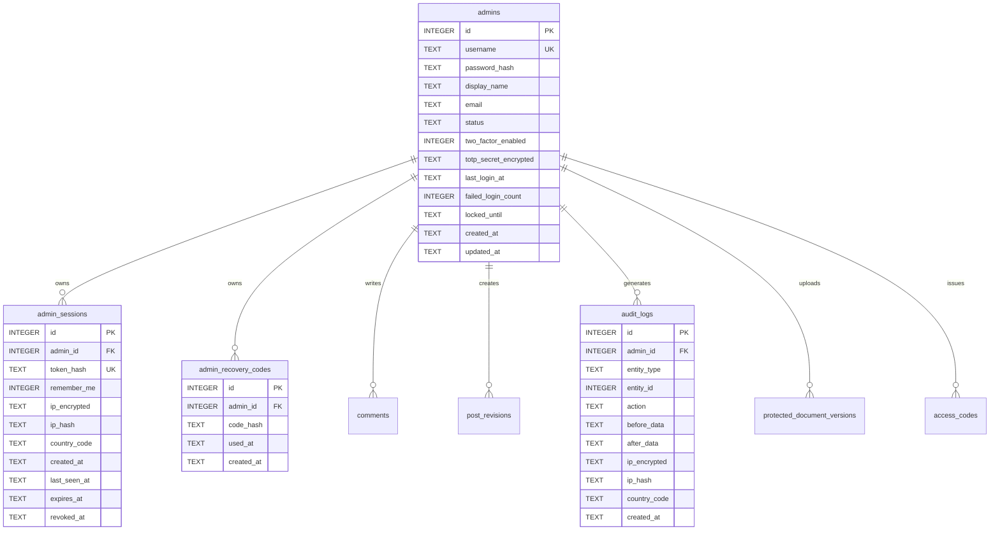
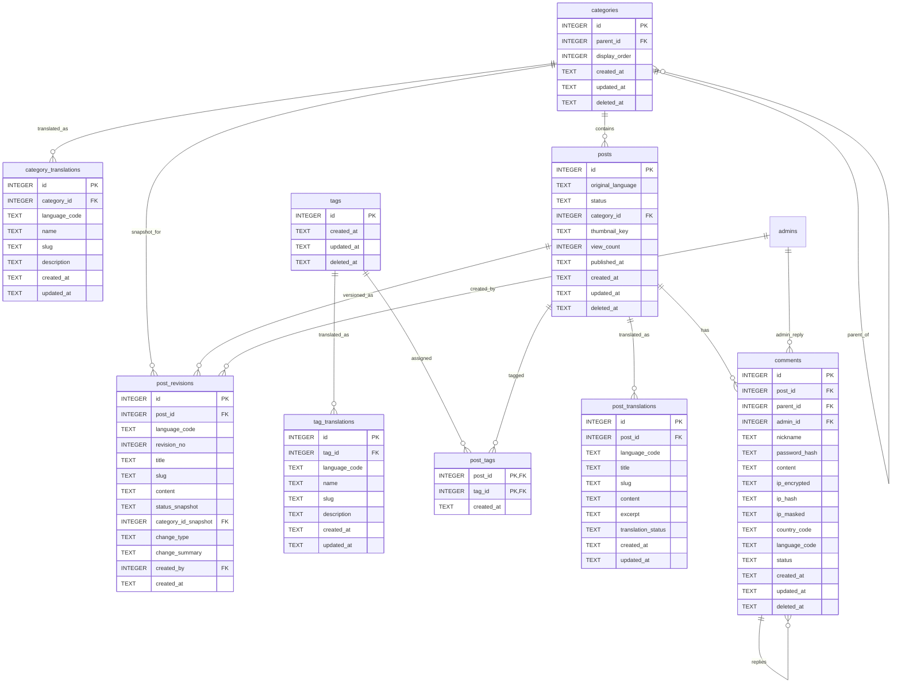
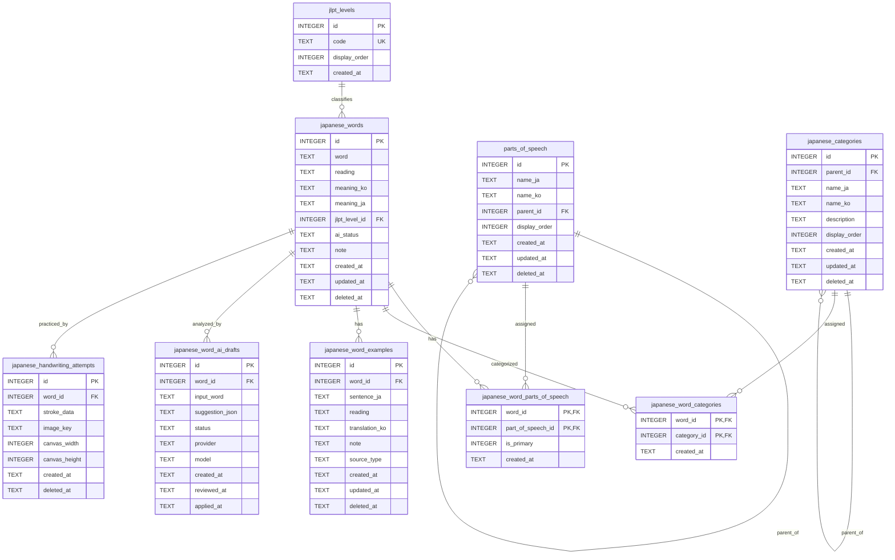
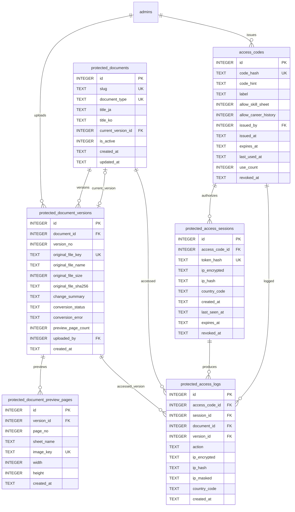
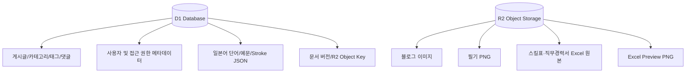

# BLOG DESIGN NOTE 06
## D1 ER 다이어그램 / D1 ERダイアグラム

작성 기준일 / 作成基準日: 2026-08-29  
기준 Migration: `0001_admin_auth.sql` ~ `0005_protected_documents.sql`  
현재 D1 테이블 수: **28 tables**

---

## 1. 목적 / 目的

### 한국어
현재 실제 Migration으로 생성된 D1 테이블의 관계를 정리한다. 전체 스키마를 한 장에 모두 표시하면 관계선이 과도하게 복잡해지므로, 먼저 전체 모듈 관계를 보여주고 이후 관리자 인증, 블로그, 일본어 학습, 보호 문서 영역으로 나누어 상세 ERD를 제공한다.

### 日本語
現在のMigrationで実際に作成されるD1テーブルの関係を整理する。全テーブルを1枚に表示すると関係線が複雑になるため、まず全体モジュール構成を示し、その後、管理者認証、ブログ、日本語学習、保護ドキュメントの各領域に分けて詳細ERDを記載する。

---

## 2. 전체 모듈 관계 / 全体モジュール関係

> `audit_logs.entity_id`는 여러 종류의 엔티티를 가리키는 논리적 참조이며 DB Foreign Key로 강제하지 않는다.

---

## 3. 전체 테이블 목록 / 全テーブル一覧

### 관리자 인증 / 管理者認証
1. `admins`
2. `admin_sessions`
3. `admin_recovery_codes`

### 블로그 / ブログ
4. `categories`
5. `category_translations`
6. `tags`
7. `tag_translations`
8. `posts`
9. `post_translations`
10. `post_tags`
11. `comments`
12. `post_revisions`
13. `audit_logs`

### 일본어 학습 / 日本語学習
14. `jlpt_levels`
15. `parts_of_speech`
16. `japanese_categories`
17. `japanese_words`
18. `japanese_word_parts_of_speech`
19. `japanese_word_categories`
20. `japanese_word_examples`
21. `japanese_word_ai_drafts`
22. `japanese_handwriting_attempts`

### 보호 문서 / 保護ドキュメント
23. `protected_documents`
24. `protected_document_versions`
25. `protected_document_preview_pages`
26. `access_codes`
27. `protected_access_sessions`
28. `protected_access_logs`

---

# 4. 관리자 인증 ERD / 管理者認証ERD

### 핵심 관계 / 主な関係

- `admins 1 : N admin_sessions`
- `admins 1 : N admin_recovery_codes`
- 한 관리자가 여러 댓글 답글, 게시글 리비전, 문서 버전, 접근 코드를 생성할 수 있다.
- 실제 세션 토큰과 복구 코드는 평문으로 DB에 저장하지 않는다.

---

# 5. 블로그 CMS ERD / ブログCMS ERD

### 관계 설명 / 関係説明

- `categories`는 `parent_id` 자기참조로 무제한 계층 구조를 표현한다.
- 카테고리와 태그의 표시명은 번역 테이블에서 `ja / ko`별로 관리한다.
- `posts`는 언어 독립 정보, `post_translations`는 제목/본문/slug 등 언어별 데이터를 담당한다.
- `posts N : M tags` 관계는 `post_tags` 중간 테이블로 구현한다.
- `comments.parent_id`는 댓글 답글 구조를 표현한다. UI는 1단계 답글까지만 표시한다.
- `post_revisions`는 게시글의 언어별 스냅샷이며 복원 시 과거 행을 수정하지 않고 새 revision을 추가한다.

---

# 6. 일본어 학습 ERD / 日本語学習ERD

### 관계 설명 / 関係説明

- 하나의 단어는 JLPT 급수 하나를 가질 수 있다.
- 단어와 품사는 N:M 관계이며 대표 품사는 한 단어당 최대 하나만 허용한다.
- 단어와 학습 분류도 N:M 관계이다.
- 한 단어에 여러 예문, AI 검토 초안, 필기 연습 기록을 연결할 수 있다.
- 필기 PNG는 R2에 저장하고 D1은 `image_key`와 `stroke_data`를 저장한다.

---

# 7. 보호 문서 ERD / 保護ドキュメントERD

### 중요 포인트 / 重要ポイント

- `protected_documents`는 스킬표/직무경력서라는 논리적 문서 자체이다.
- Excel을 갱신할 때 기존 행을 덮어쓰지 않고 `protected_document_versions`에 새 버전을 추가한다.
- `current_version_id`는 현재 외부에 보여줄 정상 버전을 가리킨다.
- `protected_document_preview_pages`는 Excel에서 변환된 각 PNG 페이지를 관리한다.
- 접근 코드 원문은 저장하지 않고 `code_hash`만 저장한다.
- 코드 인증 후 방문자 세션을 별도로 생성하고 실제 token은 브라우저 Cookie에만 보관한다.
- 열람/Excel 다운로드 이력은 `protected_access_logs`에서 추적한다.

---

# 8. R2와 D1의 책임 분리 / R2とD1の責務分離

### 원칙

- 구조화/검색/관계 데이터 → **D1**
- 이미지/Excel 등 Binary 파일 → **R2**
- D1에는 R2 파일 자체가 아니라 `key`만 저장한다.
- 보호 파일의 R2 URL을 직접 public으로 공개하지 않는다.

---

# 9. 삭제 정책과 FK 요약 / 削除ポリシー・FKまとめ

### Soft Delete 중심

다음 주요 콘텐츠는 기본적으로 `deleted_at`을 이용한다.

- `categories`
- `tags`
- `posts`
- `comments`
- `parts_of_speech`
- `japanese_categories`
- `japanese_words`
- `japanese_word_examples`
- `japanese_handwriting_attempts`

### Cascade가 사용되는 대표 관계

- `admins -> admin_sessions`
- `admins -> admin_recovery_codes`
- `posts -> post_translations`
- `posts -> post_tags`
- `posts -> comments`
- `posts -> post_revisions`
- `japanese_words -> examples / relation tables / handwriting`
- `protected_document_versions -> preview_pages`
- `access_codes -> protected_access_sessions`

### RESTRICT를 사용하는 대표 관계

- 카테고리 부모 관계
- 품사 부모 관계
- 일본어 학습 분류 부모 관계
- 보호 문서 -> 문서 버전

삭제 전에 자식/이력 존재 여부를 확인하기 위함이다.

---

# 10. ERD 유지보수 규칙 / ERDメンテナンスルール

새 Migration에서 다음 작업을 할 경우 이 문서도 갱신한다.

1. 새 테이블 추가
2. FK 추가/삭제
3. PK 또는 UNIQUE 구조 변경
4. 테이블 역할 변경
5. R2와 연결되는 새로운 Object Key 추가

Migration SQL을 **실제 스키마의 Source of Truth**로 하고, 이 ERD 문서는 사람이 이해하기 위한 설계 뷰로 유지한다.
