# BLOG DESIGN NOTE 07
## 시스템 구성 및 처리 흐름 다이어그램 / システム構成・処理フローダイアグラム

작성 기준일 / 作成基準日: 2026-08-29  
대상: Cloudflare Workers + D1 + R2 + GitHub 기반 개인 블로그/포트폴리오 시스템

---

## 1. 전체 시스템 구성도 / 全体システム構成図

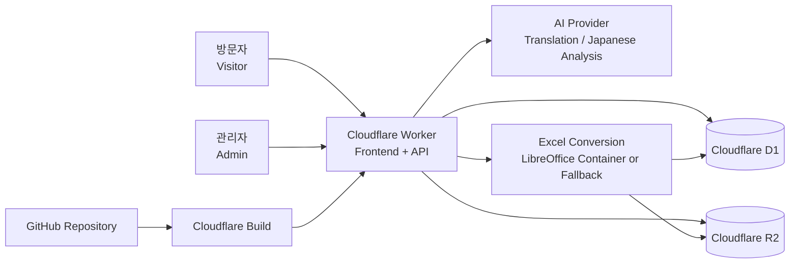

### 역할 / 役割

- **Worker**: 화면 제공, API, 인증/권한, D1/R2 접근 제어
- **D1**: 게시글, 사용자/세션, 단어, 문서 버전 등 구조화 데이터
- **R2**: 이미지, 필기 PNG, Excel 원본, 문서 프리뷰 PNG
- **GitHub + Cloudflare Build**: 소스 관리 및 `main` 자동 배포
- **AI Provider**: 게시글 번역 및 일본어 학습 데이터 제안
- **Conversion Service**: Excel → PDF/PNG 변환

---

## 2. 로컬 개발과 운영 환경 / ローカル開発・本番環境

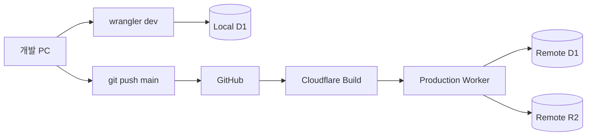

### 원칙

- 로컬 개발은 `--local` D1을 사용한다.
- 운영 D1은 명시적으로 `--remote`를 사용할 때만 직접 조작한다.
- 일반 배포는 GitHub `main` push 후 Cloudflare Build가 자동 수행한다.

---

## 3. 관리자 로그인 / 세션 / 2FA 흐름

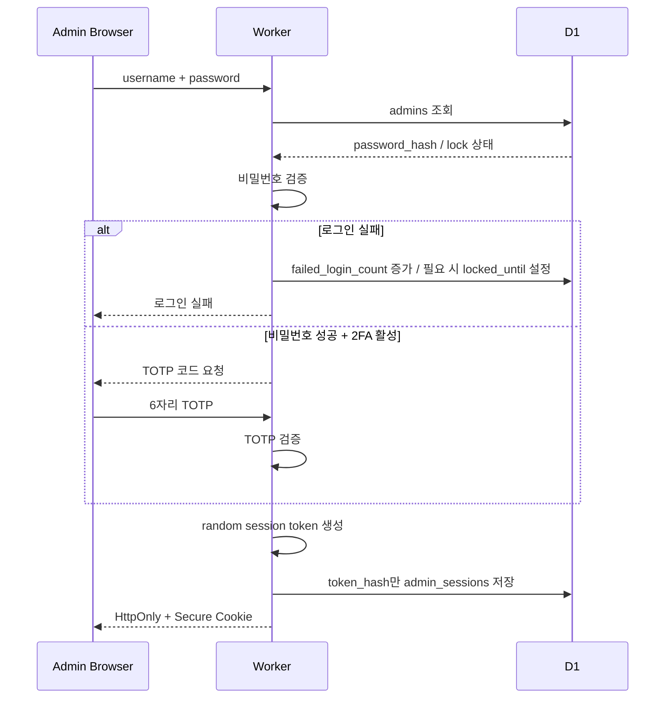

### 보안 핵심

- 실제 비밀번호/세션 토큰/TOTP secret을 평문으로 D1에 저장하지 않는다.
- 관리자 세션은 기본 30일, 로그인 유지 선택 시 최대 90일 정책을 사용한다.
- 비밀번호 변경/세션 revoke 시 기존 세션을 무효화할 수 있게 한다.

---

## 4. 게시글 작성 · 번역 · 버전 이력 흐름

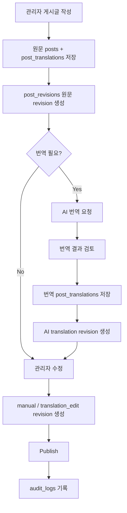

### 설계 포인트

- 일본어/한국어 번역은 페이지 조회 시 매번 생성하지 않고 저장 시 생성한다.
- AI 번역본도 관리자가 수정할 수 있다.
- 명시적 저장마다 revision을 생성한다.
- 과거 revision 복원은 기존 행을 덮어쓰지 않고 새로운 `restore` revision을 생성한다.

---

## 5. 비회원 댓글과 IP 처리 흐름

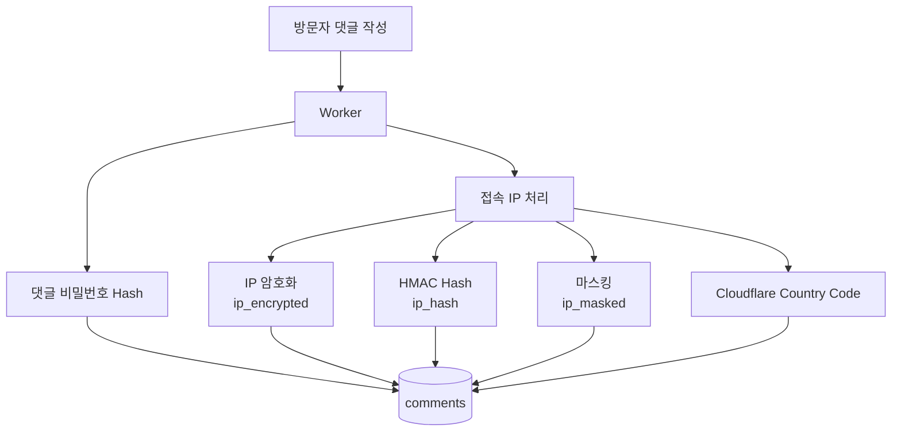

### 공개/관리자 표시

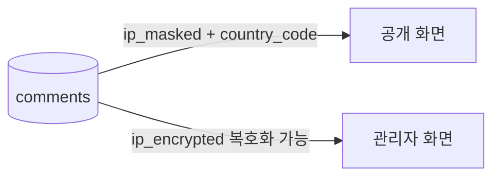

- 공개 화면에서는 전체 IP를 절대 반환하지 않는다.
- 전체 IP 복호화는 관리자 권한에서만 수행한다.

---

## 6. 일본어 단어 AI 분석 흐름

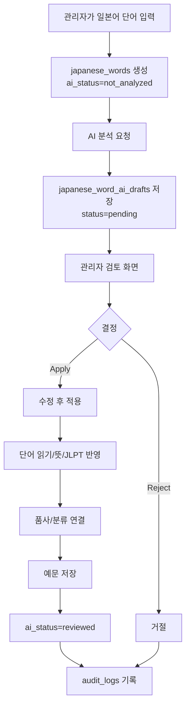

### 원칙

AI 응답은 바로 본 데이터에 덮어쓰지 않고 반드시 검토용 Draft를 거친다.

---

## 7. 일본어 필기 저장 흐름

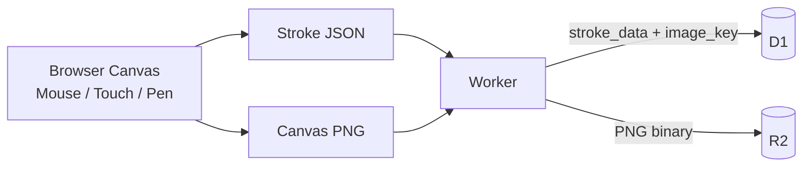

이 구조를 사용하면 향후 획 재생, 과거 시도 비교, 정확도 분석으로 확장할 수 있다.

---

## 8. 보호 문서 Excel 업로드 및 버전 생성 흐름

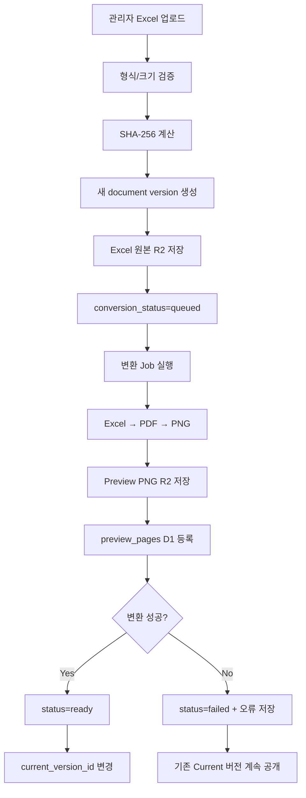

### 중요한 정책

- 기존 Excel 파일은 덮어쓰지 않는다.
- 새 업로드마다 새 `version_no`를 생성한다.
- 변환이 성공한 버전만 Current로 변경한다.
- 실패하더라도 기존 정상 공개 버전에는 영향이 없다.

---

## 9. 보호 문서 접근 코드 인증 흐름

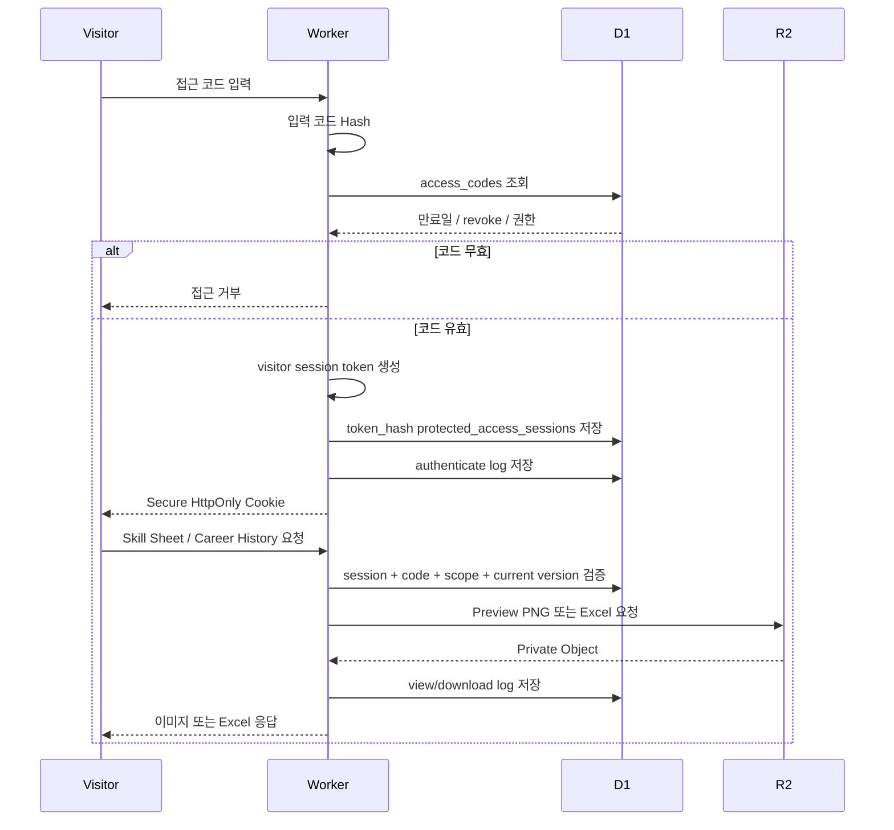

### 보안 포인트

- 접근 코드 원문은 발급 시 한 번만 보여주고 DB에는 hash만 저장한다.
- 코드 기본 유효기간은 발급일로부터 30일이다.
- 코드가 revoke되면 연결된 visitor session도 요청 시 즉시 무효로 취급한다.
- R2의 보호 문서 Object는 public URL로 직접 노출하지 않는다.

---

## 10. 보호 문서 버전 복원 흐름

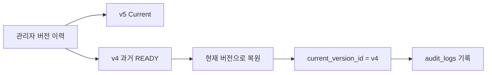

파일 복사나 덮어쓰기를 하지 않고 Pointer인 `current_version_id`만 바꾼다.

---

## 11. R2 Object 구조 / R2 Object構成

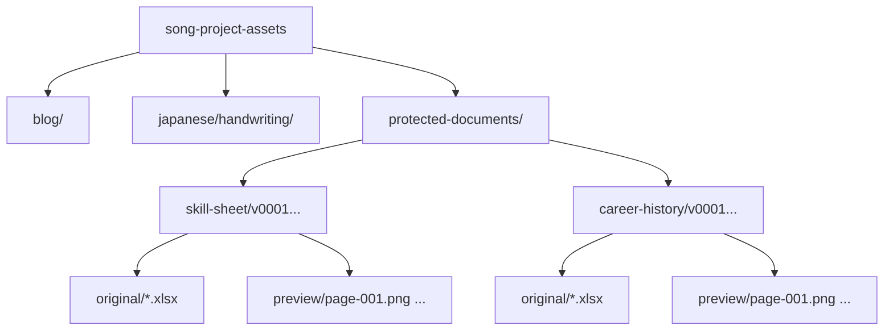

실제 Object 이름은 충돌 방지와 버전 추적이 가능하도록 규칙화한다.

---

## 12. 구현 우선순위 / 実装優先順位

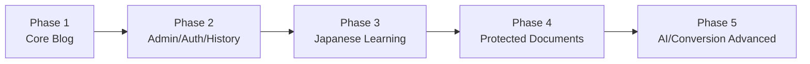

### Phase 1
- 기본 화면 구조
- 카테고리/태그
- 게시글 CRUD
- 다국어 표시
- 댓글

### Phase 2
- 관리자 인증
- Session / 2FA
- Revision / Audit

### Phase 3
- 단어/예문
- JLPT/품사/분류
- 필기 Canvas
- AI 검토 흐름

### Phase 4
- 접근 코드
- Excel 원본 업로드
- 이미지 프리뷰/다운로드
- 버전 이력

### Phase 5
- Excel 자동 변환 고도화
- AI 기능 고도화
- 모니터링/백업/운영 자동화

---

## 13. 다이어그램 유지보수 규칙 / ダイアグラム更新ルール

아래 변경이 생기면 이 문서도 업데이트한다.

- 서비스 구성요소 추가/삭제
- 인증/세션 정책 변경
- AI 처리 순서 변경
- R2 파일 저장 방식 변경
- Excel 변환 방식 변경
- 배포 흐름 변경

ER 관계 변경은 `06_er_diagram_ko-ja.md`, 동작/처리 순서 변경은 본 문서를 갱신한다.
